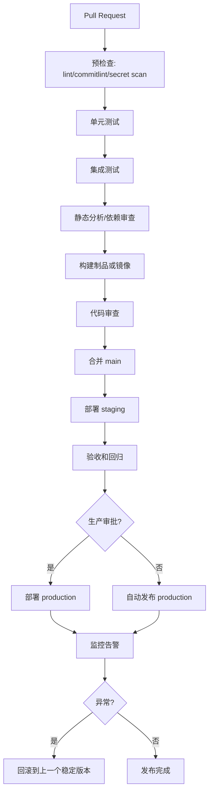

# CI/CD、测试、发布与回滚

一个好的仓库必须让合并、发布和回滚都变成标准动作，而不是靠某个“懂的人”在凌晨两点手敲命令。那不是工程，那是召唤术。

## 标准流水线



## 质量门

| 检查 | PR 阶段 | main 阶段 | release 阶段 |
|---|---:|---:|---:|
| lint | 必须 | 必须 | 必须 |
| 单元测试 | 必须 | 必须 | 必须 |
| 集成测试 | 建议 | 必须 | 必须 |
| E2E | 可选 | 建议 | 必须 |
| Secret 扫描 | 必须 | 必须 | 必须 |
| 依赖漏洞 | 必须 | 必须 | 必须 |
| 镜像扫描 | 可选 | 必须 | 必须 |
| 许可证检查 | 建议 | 必须 | 必须 |

推荐阈值：

- 新代码单元测试覆盖率 >= 80%
- blocker / critical 漏洞 = 0
- 新增 Secrets = 0
- 高危依赖漏洞 = 0
- 构建制品必须可复现

## GitHub Actions 基线

```yaml
name: ci

on:
  pull_request:
  push:
    branches: [main]

permissions:
  contents: read
  security-events: write

jobs:
  validate:
    runs-on: ubuntu-latest
    steps:
      - uses: actions/checkout@v4

      - uses: actions/setup-node@v4
        with:
          node-version: 20
          cache: npm

      - run: npm ci
      - run: npm run lint
      - run: npm run test -- --coverage

      - name: Dependency Review
        if: github.event_name == 'pull_request'
        uses: actions/dependency-review-action@v4
        with:
          fail-on-severity: high

      - name: Secret scan
        run: |
          docker run --rm -v "$PWD:/repo" zricethezav/gitleaks:latest \
            detect --source=/repo --no-banner
```

## 发布策略

推荐组合：

- SemVer 版本号
- Conventional Commits
- CHANGELOG.md
- 自动 tag
- 自动 release notes
- 镜像或制品不可变

版本含义：

| 类型 | 示例 | 含义 |
|---|---|---|
| major | 2.0.0 | 不兼容变更 |
| minor | 1.4.0 | 向后兼容新功能 |
| patch | 1.4.2 | 修复缺陷 |

## 回滚策略

回滚不是失败，是系统成熟的表现。没有回滚方案才是失败，只是失败还没来得及发生。

最低要求：

1. 每次发布记录版本号、镜像 tag、commit SHA。
2. 生产环境保留上一个稳定版本。
3. 回滚脚本必须纳入仓库。
4. 回滚也必须走审计记录。
5. 每季度演练一次。

示例：

```bash
./scripts/deploy.sh production ghcr.io/acme/myapp:2026-06-17-001
./scripts/rollback.sh production ghcr.io/acme/myapp:2026-06-16-003
```

## CI 性能指标

| 指标 | 建议目标 |
|---|---|
| PR 校验时长 | < 10 分钟 |
| main 构建时长 | < 15 分钟 |
| Pipeline 成功率 | > 90% |
| 缓存命中率 | > 60% |
| 回滚成功率 | > 95% |

CI 慢不是小问题。它会把开发者训练成“先去喝咖啡再看结果”的生物，最后大家都不再相信流水线。
