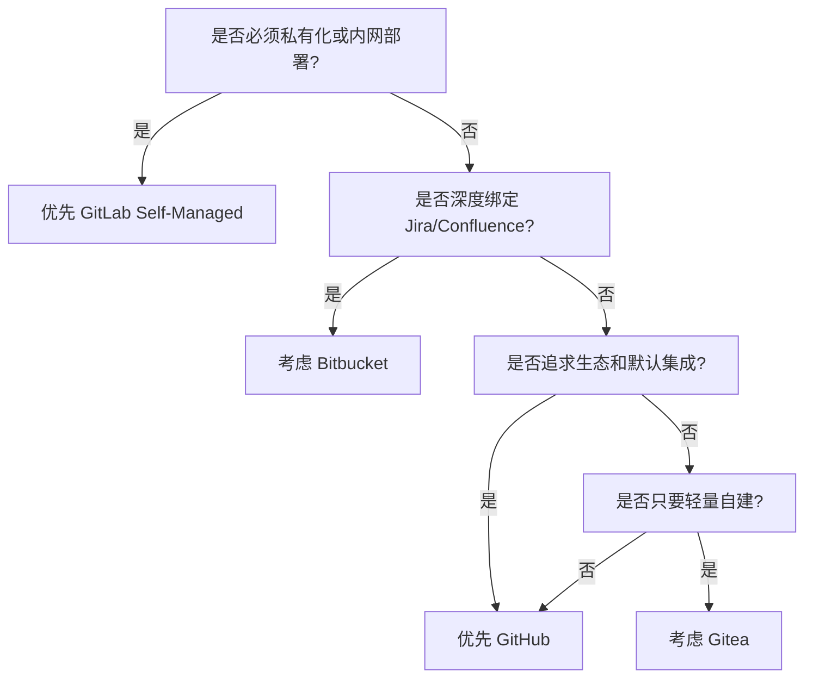

# 平台选型

## 默认选择

| 平台 | 推荐场景 | 优点 | 风险 |
|---|---|---|---|
| GitHub | 云优先、开源协作、生态集成 | Actions、CODEOWNERS、Rulesets、GHCR、生态成熟 | 高级安全和企业治理能力可能需要更高套餐 |
| GitLab | 私有化、内网、强合规 | CI/CD、环境、部署、审批、回滚、安全扫描一体化 | 自建运维复杂度更高 |
| Bitbucket | Jira / Confluence 深度用户 | Atlassian 协同顺滑，权限和 PR 流程够用 | 通用工程平台能力不如 GitHub/GitLab 集中 |
| Gitea | 轻量自建、预算敏感 | 轻、快、易部署，适合小团队 | 大规模治理需要额外平台工程投入 |

## 推荐决策树

## GitHub 推荐配置

适合大多数云原生团队：

- GitHub Team / Enterprise Cloud
- GitHub Actions
- GitHub Container Registry
- CODEOWNERS
- Branch protection 或 Rulesets
- Dependabot
- Secret scanning / Push protection
- Release automation

## GitLab 推荐配置

适合强合规、私有化、内网研发场景：

- GitLab Self-Managed 或 Dedicated
- GitLab CI/CD
- Container Registry
- Protected Branches
- Protected Environments
- Deployment Approvals
- Merge Trains
- Dependency / Secret / License scanning

## 选型建议

不要只问“哪个平台功能多”。真正该问的是：

1. 团队是否需要私有化？
2. 是否有强审计和合规要求？
3. CI/CD 是否希望内建一体化？
4. 是否需要组织级统一规则？
5. 招人和协作心智成本是否重要？
6. 迁移成本和锁定风险能否接受？

平台不是信仰，是成本结构。把 GitHub、GitLab 当宗教辩论的人，通常还没被 CI 失败折磨够。
