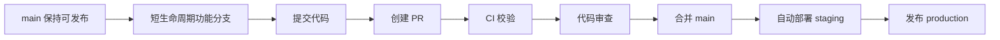

# 仓库结构、分支与提交规范

## 推荐仓库结构

```text
repo-root/
├─ apps/                   # 可部署应用，例如 web、api、worker
├─ libs/                   # 共享库，例如 sdk、domain、ui、utils
├─ deploy/                 # Helm、Kustomize、Terraform 等部署描述
├─ docs/                   # 架构、ADR、Onboarding、Runbook
├─ scripts/                # 自动化脚本
├─ tests/                  # integration、e2e
├─ .github/                # workflows、Issue/PR 模板
├─ CODEOWNERS
├─ README.md
├─ CONTRIBUTING.md
├─ SECURITY.md
├─ CHANGELOG.md
└─ Makefile
```

这套结构的目标是让仓库边界和团队边界、发布边界、测试边界、责任边界对齐。否则仓库会变成“谁都能放东西，但没人知道东西在哪”的数字仓库垃圾堆。

## Monorepo 还是 Multi-repo

| 策略 | 适合场景 | 优点 | 风险 |
|---|---|---|---|
| Bounded Monorepo | 同产品线、多应用共享大量代码 | 统一依赖、统一构建、跨包重构方便 | CI 复杂度高，需要缓存和 ownership |
| Multi-repo | 服务独立发布、独立权限、独立 SLA | 边界清晰，权限简单 | 模板、CI、规范容易漂移 |
| Mega Monorepo | 大平台团队、强基础设施 | 全局重构和统一版本非常强 | 没有平台工程会把所有人一起拖慢 |

推荐：

- 5-20 人产品团队：优先 Bounded Monorepo
- 微服务团队：优先 Multi-repo
- 100+ 人组织：除非有平台工程团队，否则不要贸然上 Mega Monorepo

## 推荐分支策略

默认使用 **Trunk-Based Development**：



### 基本流程

```bash
git switch main
git pull --ff-only
git switch -c feat/billing-retry-policy

git add .
git commit -m "feat(billing): add retry policy for failed invoices"
git push -u origin feat/billing-retry-policy
```

合并后：

```bash
git switch main
git pull --ff-only
git branch -d feat/billing-retry-policy
```

## 提交规范

使用 Conventional Commits：

```text
<type>(<scope>): <subject>
```

示例：

```text
feat(auth): add oidc login support
fix(api): handle timeout retry
docs(readme): update local setup guide
ci(actions): add dependency review
```

推荐 type：

| type | 含义 |
|---|---|
| feat | 新功能 |
| fix | 缺陷修复 |
| perf | 性能优化 |
| refactor | 重构 |
| docs | 文档 |
| test | 测试 |
| build | 构建系统 |
| ci | 流水线 |
| chore | 杂项维护 |
| revert | 回滚 |

## commitlint 示例

```js
module.exports = {
  extends: ['@commitlint/config-conventional'],
  rules: {
    'type-enum': [2, 'always', [
      'feat', 'fix', 'perf', 'refactor', 'docs',
      'test', 'build', 'ci', 'chore', 'revert'
    ]],
    'subject-case': [0],
    'header-max-length': [2, 'always', 100]
  }
}
```

## 本地检查建议

使用 pre-commit 把格式化、lint、Secret 扫描、提交消息校验前移到本地。让问题在提交前死掉，而不是在 PR 里公开处刑。
