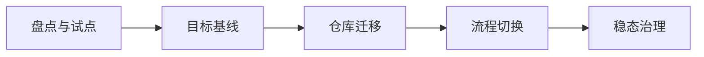

# 落地计划与可复制模板

这章用于把方案真正落地。毕竟写方案很容易，难的是让团队别在第二周就回到“直接推 main”的原始部落生活。

## 不同规模团队优先级

| 团队规模 | P0 必做 | P1 应做 | P2 可做 |
|---|---|---|---|
| 5 人团队 | 主分支保护、PR、README、基础 CI、提交规范 | CODEOWNERS、Secret 扫描、Dependabot、CHANGELOG | 预发环境、自动发布 |
| 20 人团队 | 模板仓库、规则集、CODEOWNERS、质量门 | OIDC、受保护环境、自动版本 | merge queue、远程缓存 |
| 100+ 团队 | 组织级规则、合并队列、可复用流水线、审计 | DORA 指标、集中 Onboarding、许可证策略 | 平台级安全策略、受控 monorepo |

## 五阶段迁移计划



### 1. 盘点与试点

- 盘点现有仓库、分支、PR 规则、CI、Secrets、发布方式
- 选择 1-3 个活跃仓库做试点
- 先迁移低风险但真实活跃的仓库

### 2. 目标基线

建立模板仓库，包含：

- README
- CONTRIBUTING
- SECURITY
- CHANGELOG
- CODEOWNERS
- PR / Issue 模板
- 基础 CI
- Secret 扫描
- 发布流程

### 3. 仓库迁移

```bash
git clone --mirror https://old.example.com/acme/repo.git
cd repo.git
git push --mirror https://new.example.com/acme/repo.git
```

### 4. 流程切换

- 源仓库改只读
- 新仓库启用保护规则
- 新仓库启用 CI 必须检查
- 团队从新仓库发起 PR
- 保留旧仓库回滚窗口

### 5. 稳态治理

每月检查：

- 是否有无人维护仓库
- 是否有无 CODEOWNERS 的关键路径
- 是否有 CI 长期失败
- 是否有未处理 Dependabot 警告
- 是否有无 Runbook 的生产服务
- 是否做过恢复演练

## README 模板

````md
# 项目名称

一句话描述：本项目用于 ________ 。

## 功能概览

- 能力一
- 能力二
- 能力三

## 技术栈

- Runtime:
- Framework:
- Storage:
- CI/CD:
- Registry:

## 快速开始

```bash
make setup
make test
make run
```

## 仓库结构

```text
apps/
libs/
deploy/
docs/
```

## 开发流程

1. 从 `main` 拉取短分支
2. 提交遵循 Conventional Commits
3. 发起 PR，等待 CI 与 Reviewer 通过
4. 合并后由流水线自动部署

## 质量要求

- 单元测试覆盖率：>= 80%
- 禁止直接推送 `main`
- 必须通过 lint/test/security checks

## 安全说明

- 漏洞披露见 `SECURITY.md`
- 不要提交任何密钥
````

## CONTRIBUTING 模板

````md
# 贡献指南

## 分支命名

- feat/<topic>
- fix/<topic>
- chore/<topic>

## 提交规范

使用 Conventional Commits，例如：

- feat(auth): add oidc login support
- fix(api): handle timeout retry

## 开发前检查

```bash
pre-commit install
npm ci
npm test
```

## Pull Request 要求

- PR 尽量小而清晰
- 必须说明背景、改动、测试、风险、回滚
- 涉及关键路径的 PR 需要 CODEOWNER 审批

## 代码风格

- 统一使用仓库内 formatter / linter
- 不引入未维护的依赖
- 不提交密钥、证书或生产数据
````

## CHANGELOG 模板

```md
# Changelog

本文件记录项目的主要变更。
格式参考 Keep a Changelog，版本遵循 SemVer。

## [Unreleased]

### Added
### Changed
### Fixed
### Removed
### Security
```

## 风险与回滚表

| 风险点 | 表现 | 规避措施 | 回滚方案 |
|---|---|---|---|
| 历史迁移不完整 | tag 或 refs 丢失 | 使用 `--mirror` 和 bundle 双保险 | 回到旧仓库重新导出 |
| 分支保护阻断导入 | push 失败 | 迁移前临时调整 rulesets | 临时 bypass 后重试 |
| CODEOWNERS 不生效 | 审批人没被要求 | 按平台语法校验 | 回退到默认 reviewer |
| Secrets 缺失 | 部署失败 | 建 Secrets 清单 | 回切旧流水线 |
| 新 CI 变慢 | PR 等太久 | 缓存、拆分任务、只跑受影响模块 | 非关键检查降级 nightly |
| 发布异常 | 生产部署失败 | 保留上一个稳定制品 | 重新部署上一个 tag |
